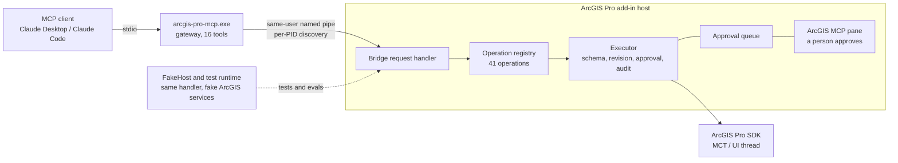

# ArcGIS Pro MCP Studio

[](https://github.com/nicoazel/ArcGISPro.MCP/actions/workflows/build.yml)
[](LICENSE)
[](#arcgis-pro-mcp-studio)

<!-- mcp-name: io.github.nicoazel/arcgis-pro-mcp -->

Claude can read and edit the project you have open in ArcGIS Pro. Anything risky shows up as a card in ArcGIS Pro that you approve or deny.

Technically: an ArcGIS Pro 3.7 add-in and a small stdio MCP gateway that let an MCP client (Claude Desktop, Claude Code, VS Code or any other) work inside the ArcGIS Pro session you already have open. The model sees 16 gateway tools, searches a registry of 41 typed, schema-validated operations and the 2,200+ installed geoprocessing tools, and invokes them by stable id. Every write is checked against the current workspace revision, every risky write waits for a person to approve those exact arguments in an ArcGIS Pro pane, and every invocation is audited.

**Status: development preview (0.3.1, unsigned).** Supported: an interactive, same-user Windows workstation with approvals in the ArcGIS MCP pane. Autonomous mode is an opt-in expert setting and is not recommended. The latest live acceptance evidence, [`docs/acceptance/2026-10-03-e7deee2`](docs/acceptance/2026-10-03-e7deee2/summary.md), covers default mode on ArcGIS Pro 3.7.1, including all 41 operations (`e7deee2` is a private-history SHA; the public commit is `c976c51`, see [Public history](docs/acceptance/README.md#public-history)); see [Verification](#verification-and-acceptance-evidence) for what it does and does not cover.

## Why this design

Most ArcGIS MCP servers take one of two approaches. This project trades some breadth for control over what runs in the user's live session.

| | This project | arcpy-subprocess MCP servers | Generic code-execution servers |
| --- | --- | --- | --- |
| Live Pro session state (open project, maps, selection, layouts) | Yes, in-process add-in | Usually no; works on files on disk | Only what the executed code can reach |
| Typed, schema-validated operations | 41 operations with input and result schemas | Per-tool, varies | No; the model writes code |
| Geoprocessing gateway | `gp.search` / `gp.describe` / `gp.run` over 2,200+ installed tools, with risk tiers | Usually a hand-picked subset | Anything, unclassified |
| Local-review approvals bound to exact arguments and revision | Yes, single-use tokens from the dockpane | Rarely | Rarely |
| Optimistic revision concurrency | Every write names the revision it read | No | No |
| Audit log | JSON lines: invocations, approvals, bypasses | Varies | Varies |
| MCP structured output, resources and prompts | Output schemas, `arcgis://` resources, prompts from skills and workflows | Varies | Varies |
| Evaluation suite | Retrieval evals, golden trajectories, live harness | Rare | Rare |

The rows for other approaches describe typical designs, not any particular project.

## Architecture

In words: the MCP client starts the gateway over stdio; the gateway talks over a same-user named pipe to the add-in inside ArcGIS Pro, where the operation registry, the executor and the approval queue live, and only a person in the pane can approve; FakeHost runs the same handler for tests.



The gateway holds no GIS logic; the add-in owns the registry, the executor and the approval queue, and only the dockpane can resolve an approval. FakeHost runs the add-in's real handler, registry and executor over fake ArcGIS services, so the end-to-end tests and evals exercise production code without ArcGIS Pro. Details: [architecture](docs/architecture.md).

## Quick start

Requirements: Windows x64, a licensed **ArcGIS Pro 3.7** (tested on 3.7.1), and the **.NET Runtime 10.x (x64)** from <https://dotnet.microsoft.com/download/dotnet/10.0> (the Runtime, not the SDK). To check the runtime, run `dotnet --list-runtimes` and look for a `Microsoft.NETCore.App 10.` line.

The steps below use version 0.3.1; replace it with the version you download. The full guide, with every client, troubleshooting, upgrade and uninstall, is [Install (users)](docs/deployment.md#install-users); the same steps ship as `INSTALL.txt` in the zip.

1. **Download and verify.** From [the latest release](https://github.com/nicoazel/ArcGISPro.MCP/releases/latest), download `ArcGISProMCP-0.3.1-win-x64-development-preview.zip` and `SHA256SUMS`. In PowerShell, in that folder, check the zip before extracting it:

   ```powershell
   $zip = 'ArcGISProMCP-0.3.1-win-x64-development-preview.zip'
   $expected = (Select-String -Path .\SHA256SUMS -SimpleMatch $zip).Line.Split(' ')[0]
   if ((Get-FileHash $zip -Algorithm SHA256).Hash -eq $expected) { 'OK' } else { 'MISMATCH - do not install' }
   ```

2. **Unblock and extract into `C:\ArcGISProMCP\`.** In the same window, run `Unblock-File $zip` and then `Expand-Archive $zip -DestinationPath C:\ArcGISProMCP` (or right-click the zip > Properties > Unblock, then Extract All to `C:\ArcGISProMCP`, removing the folder name Explorer suggests so you do not get a nested folder). The zip has one root folder, so the gateway ends up at `C:\ArcGISProMCP\ArcGISProMCP-0.3.1-win-x64-development-preview\server\arcgis-pro-mcp.exe`.
3. **Install the add-in.** Close ArcGIS Pro and double-click `ArcGISProMCP.AddIn.esriAddinX` in that folder. The add-in is unsigned: if ArcGIS Pro reports it as blocked or **MCP Studio** does not appear, go to **Project** > **Add-In Manager** > **Options**, choose **Load all Add-Ins without restrictions** and restart ArcGIS Pro (if it is greyed out, ask your IT department).
4. **Open the pane.** Open a **disposable copy** of a project. On the **Add-In** tab, click **MCP Studio** to open the **ArcGIS MCP** pane; its status should read **Ready**. Keep it open: approval cards appear there.
5. **Connect your client.** Claude Desktop: **Settings** > **Developer** > **Edit Config** (`%APPDATA%\Claude\claude_desktop_config.json`), add the entry inside `mcpServers` (keep any servers already there), save, then quit Claude Desktop from the tray icon and start it again:

   ```json
   {
     "mcpServers": {
       "arcgis-pro": {
         "command": "C:\\ArcGISProMCP\\ArcGISProMCP-0.3.1-win-x64-development-preview\\server\\arcgis-pro-mcp.exe"
       }
     }
   }
   ```

   Claude Code:

   ```powershell
   claude mcp add --scope user arcgis-pro -- "C:\ArcGISProMCP\ArcGISProMCP-0.3.1-win-x64-development-preview\server\arcgis-pro-mcp.exe"
   claude mcp list
   ```

   VS Code (`.vscode\mcp.json`, or **MCP: Open User Configuration**): `{ "servers": { "arcgis-pro": { "type": "stdio", "command": "<same path, backslashes doubled>" } } }`. Any other MCP client: run the same path as a stdio server.

   > Do not set `ARCGIS_PRO_MCP_AUTONOMOUS_MODE`: it skips the approval cards.

6. **Verify.** The client lists the `arcgis-pro` server with 16 tools. Ask *"What project is open in ArcGIS Pro?"*, then ask for a small edit, such as updating one attribute, and approve the card in the ArcGIS MCP pane.

**If it does not work:**

- `arcgis_unavailable`: ArcGIS Pro is not running or the add-in did not load; open a project and check that the pane says **Ready**.
- `arcgis_host_ambiguous`: several ArcGIS Pro windows are open. Close the extra ones, or add `"env": { "ARCGIS_PRO_MCP_HOST_PID": "<pid>" }` to the client entry, using the PID shown in the pane.
- The client says the server failed: check the path (doubled backslashes in JSON) and that `dotnet --list-runtimes` shows `Microsoft.NETCore.App 10.`, then restart the client completely.

More causes and fixes: [troubleshooting](docs/deployment.md#troubleshooting). All settings: [reference](docs/reference.md#environment-variables). To build the bundle yourself: [build the bundle](docs/deployment.md#build-the-bundle).

## Security model

| Control | Behaviour |
| --- | --- |
| Risk tiers | ReadOnly runs freely. SafeWrite needs the current workspace revision. Destructive and ExternalSideEffect operations, plus `project.open`, `project.save` and `feature.update`, also need a local-review token. |
| Confirmation | `approval_request` queues a card in the dockpane; a person approves or denies it; `approval_status` returns a short-lived, single-use token bound to the operation, its version, the exact arguments and the revision. The gateway has no way to approve its own request. |
| `gp.run` tiers | Read-only allowlisted tools run through `gp.query` without review. Every `gp.run` is reviewed, and the card warns when a tool modifies input in place, consumes credits or runs user code (Python toolboxes, expressions). |
| Dry run | `registry_invoke` with `dryRun` validates statically (for `gp.run`, against toolbox metadata) and never executes or consumes a token. |
| Autonomous mode | `ARCGIS_PRO_MCP_AUTONOMOUS_MODE=true`, opt-in and **not recommended**: it bypasses review for most risky operations. It still refuses Destructive, UserCode and unclassified `gp.run` requests unless they carry a person-issued token; revisions, schemas and audit still apply. |
| Audit | Every invocation, approval decision and autonomous bypass is appended to `%LOCALAPPDATA%\ArcGISProMCP\audit\operations.jsonl` (rotated at 16 MiB). |
| Transport | Same-user named pipe per ArcGIS Pro process, with bounded connection slots and framing timeouts. |

`gp.run` can execute arbitrary Python through Python toolboxes, script tools and expressions, with your GIS authority. Read [security and limits](docs/security.md) before connecting a client you do not fully trust. Vulnerabilities: [SECURITY.md](SECURITY.md).

## Quality

Build: .NET 10 with `TreatWarningsAsErrors`; 0 warnings. Tests (xUnit v3), all passing at the time of writing:

| Project | Tests | What it covers |
| --- | ---: | --- |
| `ArcGISProMCP.Core.Tests` | 495 | Executor policy, approvals, schemas, search, toolbox catalog and risk tiers, workflows and their layout placement, audit, acceptance manifests and the operation matrix plan, synthetic test data |
| `ArcGISProMCP.Operations.Tests` | 278 | Operation behaviour over fake ArcGIS services, and a guard that every portable descriptor matches the add-in's |
| `ArcGISProMCP.Server.Tests` | 123 | MCP contract snapshots, envelopes against output schemas, end-to-end runs through the real bridge handler, E3 trajectories |
| `ArcGISProMCP.Bridge.Tests` | 67 | Pipe framing, discovery, host scheduling and the request handler |
| `ArcGISProMCP.Evals.Tests` | 19 | Retrieval suites gated on a measured baseline, scorecard writing, descriptor dump checks |
| **Total** | **982** | |

Eval scorecard ([evals/README.md](evals/README.md); gp suites measured against ArcGIS Pro 3.7.1, 2,210 system tools):

| Suite | Tasks | recall@5 | Held-out tasks | Held-out recall@5 |
| --- | ---: | ---: | ---: | ---: |
| Registry search (E1) | 30 | 0.867 | 16 | 0.938 |
| Geoprocessing search (E2) | 30 | 0.900 | 16 | 0.875 |
| Golden trajectories (E3) (from `TrajectoryTests` on every `dotnet test`; not a committed scorecard) | 8 / 8 passed; 4 of 8 exercise approval | schemaValidArgs 1.0 | approvalDiscipline 1.0 (over the 4) | taskSuccess 1.0 |

Held-out tasks were written before search tuning and never tuned against; they are the numbers to trust.

- The held-out gains come from matching changes: stemming, camel-case splitting, IDF and a core-toolbox prior.
- Search synonyms moved only the main suites' recall@5, not the held-out one, so synonyms fitted to single main-suite tasks were removed and the main-suite numbers above went down with them ([ablation table](evals/README.md#search-tuning-phase-4)).
- No live-model scorecard is committed yet; the live harness in `evals/live` runs by hand against ArcGIS Pro or FakeHost.

CI (GitHub Actions, pinned to commit SHAs, read-only permissions): a Windows build-and-test job over every test project (the installed-Pro gp suites are skipped there, the synthetic-toolbox subset runs), a packaging job that builds the preview bundle and fails if development-only hosts or test support reach it, and a lint job (PSScriptAnalyzer, ruff). Dependabot updates NuGet packages and Actions weekly.

## Verification and acceptance evidence

Portable tests are not host acceptance. The live acceptance tooling: `tools/run-acceptance.ps1` records the commit, ArcGIS Pro version and the hashes of the built and loaded add-in DLLs into `docs/acceptance/<date>-<sha7>/`, and a Core test validates every committed folder against the [evidence contract](docs/acceptance/README.md).

The latest committed evidence is [`docs/acceptance/2026-10-03-e7deee2`](docs/acceptance/2026-10-03-e7deee2/summary.md) (version 0.3.0 at commit e7deee2, a private-history SHA; public commit c976c51, see [Public history](docs/acceptance/README.md#public-history); ArcGIS Pro 3.7.1.1904, registry 3.7.0, default mode). It covers:

- verify: Release build, every test project and the package contents;
- the four loaded add-in DLLs matching the package, the host probe (41 operations) and the MCP smoke test (16 tools);
- the three bundled urban workflows x 3 runs, with the layouts visually inspected (cosmetic legend and scale-bar overlaps are recorded);
- the live operation matrix (`tools/run-live-operations.ps1`, the `operations` section of `run-acceptance.ps1`): 41 of 41 operations covered, 90 of 90 cases passed (58 happy paths, 32 negative cases, none skipped), and eight dockpane approval cards, 7 approved and 1 denied ([operations/summary.json](docs/acceptance/2026-10-03-e7deee2/operations/summary.json)).

What it does not show:

- **Who decided the cards.** Claude decided them, operating the pane through computer use at the maintainer's direction; the maintainer did not click them. The run shows that each risky call is gated by a card and that approve and deny behave as specified, not a human reviewer's judgement.
- **Autonomous mode** and the separate feature/GP/ArcPy section of the acceptance script (not selected for this run).
- **A defect found during the run.** During the final `project.open` card, ArcGIS Pro showed its modal "Save all edits?" prompt because the matrix's feature edits were pending, and it was answered by the same means ([details](docs/acceptance/README.md#run-notes)). An MCP client cannot answer that prompt; since that commit `project.open` refuses with `pending_edits` and `project.save` also saves pending edits (see the [changelog](CHANGELOG.md)).

For anything an evidence folder does not cover, run the [manual acceptance](docs/manual-acceptance.md) checklist on your own installation and read the [known limits](docs/deployment.md#known-limits).

## Build from source

```powershell
dotnet build ArcGISPro.MCP.slnx -c Release
dotnet test ArcGISPro.MCP.slnx -c Release --no-build
./tools/pack-addin.ps1 -Configuration Release -Install   # restart ArcGIS Pro afterwards
./tools/package-release.ps1                              # the full CI gate and preview bundle
```

The build uses the `Esri.ArcGISPro.Extensions30` NuGet package, so it and the portable tests do not need ArcGIS Pro. To run an agent without ArcGIS Pro, use [FakeHost](evals/README.md#against-fakehost---host-fakehost).

## Documentation

| Topic | Read |
| --- | --- |
| Start here | [Documentation hub](docs/README.md) |
| Install, troubleshooting, upgrade, uninstall; build and release | [Deployment](docs/deployment.md) |
| Processes, operation lifecycle, threading | [Architecture](docs/architecture.md) |
| Tools, operations, resources, prompts, errors, environment | [Reference](docs/reference.md) |
| Trust boundary, approvals, risk tiers, autonomous mode | [Security and limits](docs/security.md) · [ArcPy configuration](docs/arcpy.md) |
| Evidence and live checks | [Acceptance evidence](docs/acceptance/README.md) · [Manual acceptance](docs/manual-acceptance.md) |
| Evaluations | [evals/README.md](evals/README.md) |
| Demos, showcase and fixtures | [Demos](docs/demos.md) |
| Plans and history | [Roadmap](https://github.com/nicoazel/ArcGISPro.MCP/blob/main/docs/ROADMAP.md) · [Changelog](https://github.com/nicoazel/ArcGISPro.MCP/blob/main/CHANGELOG.md) |

## Contributing, security and license

Contributions are welcome; see [CONTRIBUTING.md](CONTRIBUTING.md) and the [code of conduct](CODE_OF_CONDUCT.md). Report vulnerabilities privately as described in [SECURITY.md](SECURITY.md). Licensed under [Apache-2.0](LICENSE). ArcGIS Pro and other Esri products require their own licenses.

ArcGIS and ArcGIS Pro are trademarks of Esri; this project is not affiliated with or endorsed by Esri.
