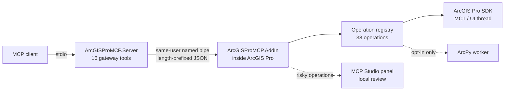

# ArcGIS Pro MCP Studio documentation

ArcGIS Pro MCP Studio lets a Model Context Protocol client drive a running ArcGIS Pro 3.7 session through a small gateway, a searchable operation registry, and a local review panel. Start with the path that matches what you are doing.

## Choose a path

| I want to... | Read |
| --- | --- |
| Build, install, and connect a client | [Main README](../README.md#build-and-install), then [deployment and rollback](deployment.md) |
| Understand how requests flow and where code lives | [Architecture](architecture.md) |
| Look up a tool, operation, environment variable, or workflow | [Reference](reference.md) |
| Decide whether it is safe to run on a workstation | [Security and operational limits](security.md) |
| Enable the optional Python escape hatch | [ArcPy configuration](arcpy.md) |
| Sign off a build on a live ArcGIS Pro install | [Manual acceptance](manual-acceptance.md), then [production readiness](production-readiness.md) |
| Pick up development in a new session | [Fresh-context handoff](FRESH_CONTEXT_HANDOFF.md) |

## Guides

### Get started
- **[Deployment and rollback](deployment.md)**: builds the release bundle, verifies it before installing, configures the MCP client, and rolls back a bad install.
- **[Architecture](architecture.md)**: process boundaries, the six-step operation lifecycle, threading rules, and how to add a new operation.

### Operate safely
- **[Security and operational limits](security.md)**: the trust boundary, revision checks, approval tokens, autonomous mode, idempotency, pipe limits, and `outcome_unknown` semantics.
- **[ArcPy configuration](arcpy.md)**: turning on hash-pinned ArcPy scripts, with their script and working roots, limits, and trust boundary.

### Verify and release
- **[Manual acceptance](manual-acceptance.md)**: the live checklist for feature data, metadata, geoprocessing, ArcPy, and stability on a disposable project.
- **[Production readiness](production-readiness.md)**: the current acceptance result by gate, the implemented surface, known scope limits, and where the evidence is.

## How a model uses the gateway

The gateway exposes only 16 tools. The full catalog of GIS operations stays server-side and reaches the model only when the model searches for it.

1. `system_get_state`: read the project snapshot and keep its **workspace revision**.
2. `registry_search` / `registry_browse`: find candidate operations by intent.
3. `registry_describe`: load the schema for the few operations the task needs.
4. `registry_validate`: check arguments against live state without changing anything.
5. `registry_invoke`: run the operation with the revision. Destructive and external-side-effect operations first need `approval_request`, a person approving in the panel, and `approval_status` to return a single-use token.
6. `resource_read`: fetch returned images and larger observations by `arcgis://` handle.

Reusable multi-step recipes go through `workflow_list` → `workflow_get` → `workflow_run`, and `skill_search` / `skill_get` supply the guidance for them. See the [reference](reference.md) for every tool and operation.
